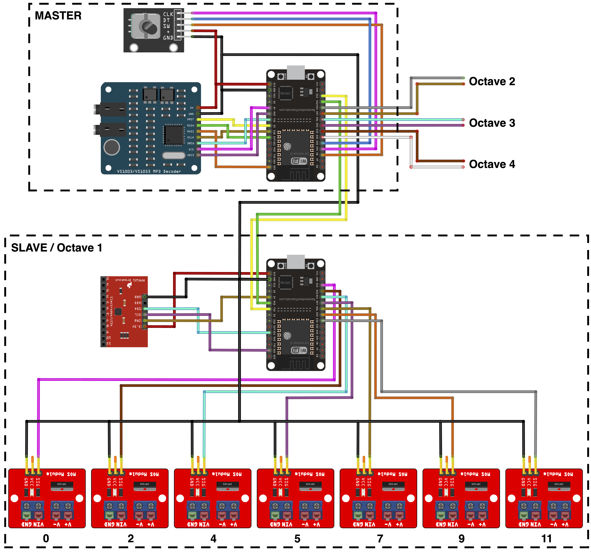

# Floor piano

## Prerequisites

1. 5x [ESP32](https://www.espressif.com/en/products/socs/esp32)
2. 4x [MPR121](https://components101.com/modules/mpr121-capacitive-touch-sensor-module)
3. [VS1003 (or VS1053)](https://www.vlsi.fi/fileadmin/datasheets/vs1003.pdf)
4. [KY-040 (Rotary Encoder)](http://handsontec.com/dataspecs/module/Rotary%20Encoder.pdf)

## Schematics

# Installation instructions
# Slave

Upload [`slave/slave.ino`](slave/slave.ino) to 4 ESP32 boards and connect it to master according to schematics. The slaves are mutually **independent**, allowing each of them to work independently also when others are not connected to the master. For more detailed wiring look at the source `slave.ino` file.

# Master

Upload [`master/master.ino`](master/master.ino) to 1 ESP32 board and connect the peripheral devices according to schematics. For more detailed wiring look at the source `master.ino` file.

## Wiring

### 1. VS1003

The VS1003 module is used for audio playback. Connect the VS1003 pins to the ESP32 as follows:

| VS1003  |  ESP32  | ESP32 (GPIO) |
|:-------:|:-------:|:------------:|
|   SCLK  |   D18   |     18       |
|   MISO  |   D19   |     19       |
|   MOSI  |   D23   |     23       |
|   XRST  |   D5    |     5        |
|   CS    |   D4    |     4        |
|   XDCS  |   RX2   |     16       |
|   DREQ  |   TX2   |     17       |
|   5V    |   3.3V  |     3.3V     |
|   GND   |   GND   |     GND      |

### 2. Octaves (UART)

The program supports up to 4 Octave devices connected through UART communication. Connect the RX pins from the slave controllers to the TX pins on the master controller, and the TX pins from the slave controllers to the master RX pins on the master controller. The following table describes the wiring for each Octave device:

Octave 1:
| UART 1  |  ESP32  | ESP32 (GPIO) |
|:-------:|:-------:|:------------:|
|   RX    |   D13   |     13       |
|   TX    |   D12   |     12       |

Octave 2:
| UART 2  |  ESP32  | ESP32 (GPIO) |
|:-------:|:-------:|:------------:|
|   RX    |   D14   |     14       |
|   TX    |   D27   |     27       |

Octave 3:
| UART 3  |  ESP32  | ESP32 (GPIO) |
|:-------:|:-------:|:------------:|
|   RX    |   D26   |     26       |
|   TX    |   D25   |     25       |

Octave 4:
| UART 4  |  ESP32  | ESP32 (GPIO) |
|:-------:|:-------:|:------------:|
|   RX    |   D33   |     33       |
|   TX    |   D32   |     32       |

### 3. Rotary Encoder

A rotary encoder is used to select the channel (instrument). Connect the rotary encoder pins to the ESP32 as follows:

| KY-040  |  ESP32  | ESP32 (GPIO) |
|:-------:|:-------:|:------------:|
|   CLK   |   D34   |     34       |
|   DT    |   D35   |     35       |
|   SW    |   VN    |     39       |